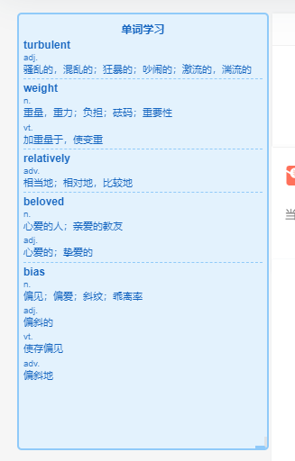
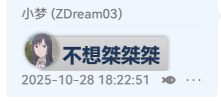
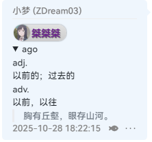
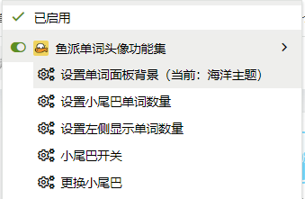
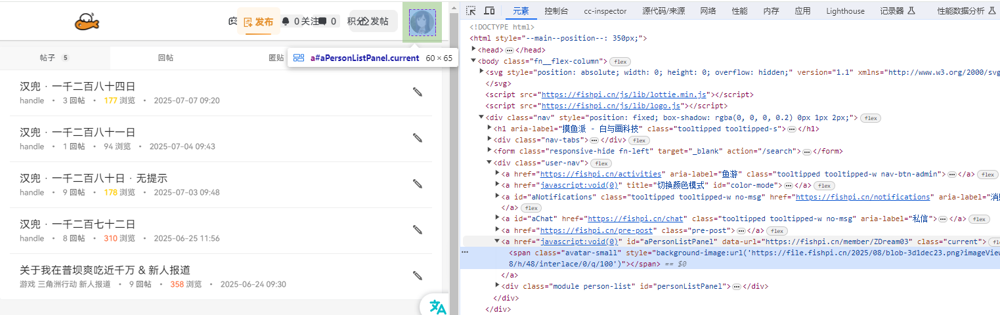

# Tail Word Avatar

一个集成了单词面板显示、头像生成和聊天小尾巴功能的工具，特别适合英语单词学习。

## 版本信息
- 当前版本：v1.0.2

## 功能特点

- **单词面板显示** - 在聊天界面左侧显示考研单词，支持拖拽和调整大小
  
  
- **单词面板样式** - 支持10种精美主题样式：
  - 默认主题、暗黑主题、海洋主题、森林主题、晚霞主题
  - 新增：优雅紫色、清新薄荷、科技蓝、温暖橙色、梦幻粉色
  
- **头像生成功能** - 根据输入的单词或文字生成自定义头像
  
  
- **头像自定义** - 支持自定义头像文字、背景图片、颜色和样式
  - 通过油猴菜单支持动态修改头像背景URL
  - 提供18种预设渐变颜色组合供选择
  
- **聊天小尾巴** - 自动在发送的消息后添加可爱的小尾巴
  
  
- **小尾巴开关** - 可随时开启或关闭小尾巴功能
- **更换小尾巴** - 支持选择预设小尾巴或自定义小尾巴内容
- **自定义小尾巴触发** - 使用字母x触发自定义小尾巴功能
- **优化界面** - 移除快捷消息按钮，专注于单词学习体验
- **隐藏机器人元素** - 自动隐藏聊天界面中的机器人元素，优化视觉体验

## 文件结构

- `tail_word_avatar.js` - 主程序文件，包含所有核心功能实现
- `parse_words_csv.js` - 单词 CSV 解析工具，用于处理考研单词数据
- `parsed_words.js` - 解析后的单词数据文件
- `2024墨墨考研深度记忆宝典 全部单词.csv` - 考研单词原始数据

## 使用方法

1. 将 `tail_word_avatar.js` 脚本安装到 Tampermonkey/Violentmonkey 等油猴扩展
2. 刷新聊天页面，左侧将出现单词学习面板
3. 使用油猴菜单可设置小尾巴功能和其他选项
   
4. 点击头像生成按钮创建自定义头像

## 菜单命令说明

- **小尾巴开关** - 切换小尾巴功能的开启和关闭状态
- **更换小尾巴** - 选择预设小尾巴或设置自定义小尾巴内容
- **设置左侧单词数量** - 调整单词面板显示的单词数量
- **设置头像背景URL** - 通过对话框修改头像背景图片URL
- **选择头像颜色组合** - 打开颜色选择面板，提供18种预设渐变颜色方案

## 感谢

感谢以下项目和个人对本项目的帮助：

1. **脚本原作者** - 感谢江户川-哀酱(APTX-4869)的脚本
2. **墨墨背单词词库** - 感谢 [https://github.com/busiyiworld/maimemo-export](https://github.com/busiyiworld/maimemo-export) 提供的词库资源

## 开发说明

该项目使用 JavaScript 开发，基于油猴脚本框架，支持在各种鱼排聊天室使用。项目结合了单词学习和聊天增强功能，旨在帮助用户在日常摸鱼学习英语单词。

## 词库更换指南

您可以按照以下步骤更换为自定义词库：

1. **准备CSV词库文件**：创建或获取包含单词数据的CSV文件，确保格式与原词库相似（通常包含单词、释义等信息）
2. **修改文件路径**：编辑`parse_words_csv.js`文件，找到第6行附近的CSV文件路径定义，将`2024墨墨考研深度记忆宝典 全部单词.csv`修改为您的新CSV文件名
   ```javascript
   // 修改前
   const csvPath = path.join(__dirname, '2024墨墨考研深度记忆宝典 全部单词.csv');
   // 修改后
   const csvPath = path.join(__dirname, '您的新词库文件名.csv');
   ```
3. **重新解析词库**：运行`parse_words_csv.js`脚本来处理新的词库数据
   ```bash
   node parse_words_csv.js
   ```
4. **更换词库**：修改并替换掉 `const postgraduateWords1` 数组内容
5. **更新脚本**：确保`parsed_words.js`文件已被正确更新
6. **刷新页面**：重新加载聊天页面，新的单词将在左侧面板中显示

## 头像和颜色自定义指南

本工具支持丰富的头像自定义选项，您可以按照以下方法修改头像样式：


*头像自定义效果示例*

### 配置选项说明

在`tail_word_avatar.js`文件中，第39行附近有一个`avatarConfig`对象，包含以下可配置项：

- **defaultText**: 默认头像文字，生成头像时的默认提示文本
- **baseImageUrl**: 基础背景图片URL，头像的背景图像
- **generateApiUrl**: 头像生成API地址
- **scale**: 图片缩放比例，控制头像清晰度
- **backgroundColor**: 背景颜色（十六进制值）
- **fontColor**: 字体颜色（十六进制值）

### 使用油猴菜单自定义头像（推荐）

#### 1. 修改头像背景URL
1. 点击浏览器工具栏中的油猴图标
2. 选择「设置头像背景URL」选项
3. 在弹出的对话框中输入新的头像背景图片URL
4. 点击确定保存设置


#### 2. 选择预设颜色组合
1. 点击浏览器工具栏中的油猴图标
2. 选择「选择头像颜色组合」选项
3. 在弹出的颜色选择面板中，点击您喜欢的颜色组合
4. 系统会自动保存您的选择并关闭面板


### 预设颜色组合列表
脚本提供了18种精心设计的渐变颜色组合，包括：

1. **单色渐变**：
   - 紫色系、蓝色系、绿色系、红色系、黄色系、黑色系
   - 橙色系、粉色系、青色系、紫罗兰色、金色系、海蓝色系

2. **跨色系渐变**：
   - 紫色到蓝色、橙色到红色、绿色到青色
   - 粉色到紫色、蓝色到青色、黄色到橙色

### 直接修改代码自定义

1. **打开脚本文件**：在油猴扩展中编辑`tail_word_avatar.js`脚本
2. **找到配置部分**：定位到配置相关代码
3. **修改配置值**：根据需要调整各配置项的值
   - 修改文字颜色示例：将`fontColor: '1A365D'`改为`fontColor: 'FF5733'`
   - 修改背景颜色示例：将`backgroundColor: 'D3D3D3'`改为`backgroundColor: 'C0E8FF'`
   - 修改默认文字示例：将`defaultText: '不想桀桀桀'`改为`defaultText: '新的默认文字'`
4. **保存修改**：保存脚本更改
5. **刷新页面**：重新加载聊天页面使配置生效

> 注意：通过代码修改的配置可能会被油猴菜单的设置覆盖，建议使用油猴菜单进行自定义

### 自定义背景图片

您可以使用自己喜欢的图片作为头像背景：

1. 将您的图片上传到支持外链的图床服务
2. 获取图片的公开URL
3. 修改`baseImageUrl`配置项为您的图片URL
4. 要获取个人的鱼排头像URL,可以使用F12大法


tips : 目前gif的图片好像使用不了。

### 配置持久化

所有通过油猴菜单进行的设置都会自动保存到浏览器的localStorage中，页面刷新后设置不会丢失，确保您的个性化配置能够持续使用。
### 颜色值参考

常用颜色十六进制值：
- 红色: FF0000
- 蓝色: 0000FF
- 绿色: 00FF00
- 黄色: FFFF00
- 紫色: 800080
- 橙色: FFA500
- 灰色: 808080
- 黑色: 000000
- 白色: FFFFFF

## 注意事项

本工具仅用于学习和个人使用，词库版权归原作者所有。使用时请遵守相关平台的使用规范。

词库更换时请确保CSV文件格式正确，否则可能导致解析失败。

自定义头像配置时，请确保使用有效的十六进制颜色值（不含#号），避免使用过大的图片作为背景图以确保加载速度。