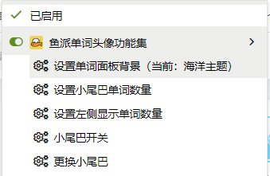

# 头像生成脚本 (simple_avatar_script.js) 说明文档

## 脚本概述

**头像生成脚本**是一个轻量级的油猴脚本，专为鱼排聊天室(fishpi.cn)设计，提供了头像生成功能。该脚本是[Tail Word Avatar](README.md)项目的简化版本，专注于头像生成功能。

## 主要功能

### 1. 头像生成功能
- 提供自定义文字头像生成按钮
- 支持自定义头像文字内容
- 支持配置背景图片、颜色和字体颜色
- 通过油猴菜单支持动态修改头像背景URL
- 提供41种预设渐变颜色组合供选择
- 支持测试模式，可以一次性查看所有颜色组合效果而不发送消息
- 支持自定义头像大小，通过滑块灵活调整从0.5到5.0的缩放比例

### 2. 自动初始化与重试机制
- 页面加载完成后自动初始化
- 包含重试机制，确保功能能正确应用在动态加载的页面中

### 4. 油猴菜单功能
- **设置头像背景URL**：通过对话框修改头像背景图片URL
- **选择头像颜色组合**：打开颜色选择面板，提供18种预设渐变颜色方案

## 配置说明

脚本中的配置项通过`loadConfig`函数从`localStorage`加载，包含以下可自定义选项：

```javascript
// 默认配置结构
const defaultConfig = {
    // 默认头像文字
    defaultText: '不想桀桀桀',
    generateApiUrl: 'https://fishpi.cn/gen?ver=0.1&scale=1.5',
    backgroundColor: 'ffffff,E8D5FF',
    fontColor: '9933CC,ffffff',
    baseImageUrl: '',
    scale: 0.79, // 默认缩放比例
    testMode: true // 默认启用测试模式
};
```

- **defaultText**: 生成头像时的默认提示文字
- **generateApiUrl**: 头像生成API地址
- **backgroundColor**: 头像背景颜色（十六进制值，支持渐变色）
- **fontColor**: 头像文字颜色（十六进制值，支持渐变色）
- **baseImageUrl**: 头像背景图片URL
- **scale**: 头像缩放比例，控制头像的大小和清晰度，范围0.5-5.0，默认0.79
- **testMode**: 测试模式开关，用于调试头像生成效果

> 注意：现在配置会自动保存到浏览器的localStorage中，用户通过油猴菜单进行的设置将在页面刷新后保留

## 使用方法

1. 将脚本安装到Tampermonkey、Violentmonkey等油猴扩展
2. 访问鱼排聊天室网站（https://fishpi.cn/）
3. 通过油猴菜单可以配置头像相关设置

### 调整头像大小
1. 点击浏览器工具栏中的油猴图标
2. 选择「设置头像大小」选项
3. 在弹出的面板中，拖动滑块调整头像大小（范围：0.5-5.0）
4. 实时预览框会显示调整效果
5. 点击「确认」保存设置，或点击「取消」放弃更改

> 注意：头像大小设置会自动保存到浏览器的localStorage中，页面刷新后设置不会丢失

## 代码结构

### 1. 脚本元数据
脚本顶部包含标准油猴脚本元数据，定义脚本名称、版本、匹配网站等信息。

### 2. 预设颜色组合数组
定义18种预设的渐变颜色组合，包括单色渐变和跨色系渐变。

### 3. 配置管理函数
- **loadConfig**: 从localStorage加载配置或使用默认配置
- **saveConfig**: 将配置保存到localStorage

### 4. 头像配置对象
通过loadConfig函数动态加载头像生成所需的各种参数。

### 5. 颜色选择面板函数 (`createColorSelectionPanel`)
创建可视化的颜色选择面板，显示所有预设颜色组合。

### 6. 头像URL设置函数 (`setAvatarUrl`)
提供对话框供用户修改头像背景图片URL。

### 7. 油猴菜单注册
注册油猴脚本菜单命令，包括设置头像URL和选择颜色组合。

### 8. 初始化函数 (`init`)
脚本的入口函数，负责初始化功能并启动重试机制。

### 9. 页面加载监听
确保脚本在页面加载完成后正确初始化。

## 技术细节

- **头像生成原理**：通过构造特定格式的URL调用鱼排头像生成API
- **错误处理**：包含try-catch异常捕获和控制台错误日志记录
- **防重复逻辑**：避免重复初始化功能

## 与主项目的关系

此脚本是[Tail Word Avatar](README.md)项目的简化版本，专注于头像生成功能，不包含单词面板显示功能。

## 自定义指南

### 使用油猴菜单自定义头像
现在，您可以通过油猴菜单更方便地自定义头像样式，无需直接修改代码：

#### 1. 修改头像背景URL
1. 点击浏览器工具栏中的油猴图标
2. 选择「设置头像背景URL」选项
3. 在弹出的对话框中输入新的头像背景图片URL
4. 点击确定保存设置



#### 2. 选择预设颜色组合
1. 点击浏览器工具栏中的油猴图标
2. 选择「选择头像颜色组合」选项
3. 在弹出的颜色选择面板中，点击您喜欢的颜色组合
4. 系统会自动保存您的选择并关闭面板


### 预设颜色组合列表
脚本提供了18种精心设计的渐变颜色组合，包括：

1. **单色渐变**：
   - 紫色系、蓝色系、绿色系、红色系、黄色系、黑色系
   - 橙色系、粉色系、青色系、紫罗兰色、金色系、海蓝色系

2. **跨色系渐变**：
   - 紫色到蓝色、橙色到红色、绿色到青色
   - 粉色到紫色、蓝色到青色、黄色到橙色

### 直接修改代码自定义
如果您希望直接通过修改代码来自定义（不推荐，因为设置不会被保存），可以参考以下示例：

#### 1. 修改默认文字和颜色
```javascript
// 示例：修改默认文字和颜色
const defaultConfig = {
    defaultText: '新的默认文字',
    backgroundColor: 'FFFFFF,FFFF00', // 白到黄的渐变色
    fontColor: 'FF0000,0000FF', // 红到蓝的渐变色
    generateApiUrl: 'https://fishpi.cn/gen?ver=0.1&scale=0.79',
    baseImageUrl: 'https://file.fishpi.cn/2025/08/blob-3d1dec23.png'
};
```

### 添加新的预设颜色组合
如果您想添加更多的预设颜色组合，可以修改`presetColorCombinations`数组：

```javascript
// 在presetColorCombinations数组中添加新的颜色组合
const presetColorCombinations = [
    // 现有颜色组合...
    {
        name: '新色系名称',
        backgroundColor: '颜色1,颜色2', // 两个十六进制颜色值，用逗号分隔
        fontColor: '文字颜色1,文字颜色2' // 两个十六进制颜色值，用逗号分隔
    }
];
### 获取鱼排头像URL的方法
如果您想使用鱼排网站上的图片作为背景：
1. 访问鱼排网站并登录
2. 使用浏览器的开发者工具（F12）
3. 找到并复制您喜欢的图片URL
4. 通过油猴菜单的「设置头像背景URL」功能粘贴使用


## 注意事项

- 脚本仅在鱼排聊天室(fishpi.cn)网站生效
- 自定义头像背景图片时建议使用较小的图片以确保加载速度
- 如需更完整的功能，请使用[Tail Word Avatar](README.md)主项目