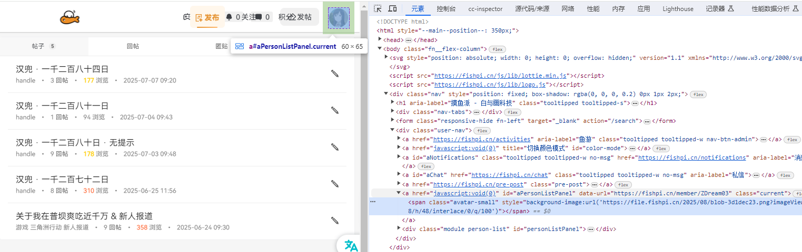

# 头像生成脚本 (simple_avatar_script.js) 说明文档

## 脚本概述

**头像生成脚本**是一个轻量级的油猴脚本，专为鱼排聊天室(fishpi.cn)设计，提供了头像生成和快捷聊天功能。该脚本是[Tail Word Avatar](README.md)项目的简化版本，专注于头像生成和聊天快捷功能。

## 主要功能

### 1. 头像生成功能
- 提供自定义文字头像生成按钮
- 支持自定义头像文字内容
- 支持配置背景图片、颜色和字体颜色

### 2. 快捷聊天按钮
- 提供6个快捷聊天按钮，分别为：
  - **打劫**：发送「冰冰 去打劫」消息
  - **鸽**：发送「鸽 行行好吧」消息
  - **红包**：发送「冰冰 来个红包」消息
  - **雷**：发送「雷公助我」消息
  - **火**：发送「火烧连营」消息
  - **Test**：打开头像生成对话框

### 3. 自动初始化与重试机制
- 页面加载完成后自动初始化
- 包含30次重试机制，确保按钮能正确显示在动态加载的页面中

## 配置说明

脚本中的配置项位于`avatarConfig`对象中，包含以下可自定义选项：

```javascript
const avatarConfig = {
    // 默认头像文字
    defaultText: '不想桀桀桀',
    generateApiUrl: 'https://fishpi.cn/gen?ver=0.1&scale=0.79',
    backgroundColor: 'ffffff,E8D5FF',
    fontColor: '9933CC,ffffff',
    baseImageUrl: 'https://file.fishpi.cn/2025/08/blob-3d1dec23.png'
};
```

- **defaultText**: 生成头像时的默认提示文字
- **generateApiUrl**: 头像生成API地址
- **backgroundColor**: 头像背景颜色（十六进制值，支持渐变色）
- **fontColor**: 头像文字颜色（十六进制值，支持渐变色）
- **baseImageUrl**: 头像背景图片URL

## 使用方法

1. 将脚本安装到Tampermonkey、Violentmonkey等油猴扩展
2. 访问鱼排聊天室网站（https://fishpi.cn/）
3. 在聊天输入框上方将自动显示6个红色按钮
4. 点击**Test**按钮可打开头像生成对话框，输入自定义文字
5. 点击其他按钮可快速发送对应消息

## 代码结构

### 1. 脚本元数据
脚本顶部包含标准油猴脚本元数据，定义脚本名称、版本、匹配网站等信息。

### 2. 头像配置对象
定义头像生成所需的各种参数，可自定义修改。

### 3. 消息发送函数 (`sendMsgApi`)
使用AJAX直接调用聊天API发送消息，包含错误处理机制。

### 4. 按钮创建函数 (`createButtons`)
负责创建按钮区域和所有快捷按钮，并设置按钮样式和点击事件。

### 5. 初始化函数 (`init`)
脚本的入口函数，负责初始化按钮并启动重试机制。

### 6. 页面加载监听
确保脚本在页面加载完成后正确初始化。

## 技术细节

- **消息发送机制**：使用`$.ajax`异步请求发送消息到鱼排聊天API
- **头像生成原理**：通过构造特定格式的URL调用鱼排头像生成API
- **错误处理**：包含try-catch异常捕获和控制台错误日志记录
- **防重复逻辑**：添加按钮前检查元素是否已存在，避免重复添加

## 与主项目的关系

此脚本是[Tail Word Avatar](README.md)项目的简化版本，专注于头像生成和快捷聊天功能，不包含单词面板显示功能。

## 自定义指南

### 修改头像样式
如需修改头像默认样式，可直接编辑`avatarConfig`对象中的配置项：


*头像自定义效果示例*

#### 1. 修改文字和颜色
```javascript
// 示例：修改默认文字和颜色
avatarConfig.defaultText = '新的默认文字';
avatarConfig.fontColor = 'FF0000,0000FF'; // 红到蓝的渐变色
avatarConfig.backgroundColor = 'FFFFFF,FFFF00'; // 白到黄的渐变色
```

#### 2. 修改背景图片
要更换头像的背景图片，请修改`baseImageUrl`配置项：

```javascript
// 示例：修改背景图片
avatarConfig.baseImageUrl = 'https://example.com/your-custom-image.png';
```
您可以使用自己喜欢的图片作为头像背景：
获取鱼排头像URL的方法：
1. 访问鱼排网站并登录
2. 使用浏览器的开发者工具（F12）
3. 找到并复制您的头像图片URL
4. 将复制的URL粘贴到`baseImageUrl`配置项中




### 添加新的快捷按钮
如需添加新的快捷按钮，可参考现有按钮创建代码：

```javascript
// 示例：添加新按钮
var newButton = document.createElement('button');
newButton.id = 'new-button';
newButton.textContent = '新按钮';
newButton.className = 'red';
newButton.setAttribute('style', 'margin-right:5px');
newButton.onclick = function() {
    sendMsgApi('新按钮发送的消息');
};

// 添加到图层，避免重复添加
if (!document.getElementById('new-button')) elve.appendChild(newButton);
```

## 注意事项

- 脚本仅在鱼排聊天室(fishpi.cn)网站生效
- 自定义头像背景图片时建议使用较小的图片以确保加载速度
- 如需更完整的功能，请使用[Tail Word Avatar](README.md)主项目